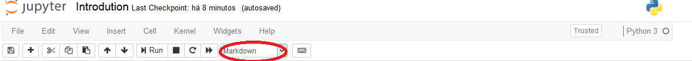
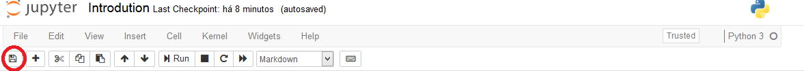
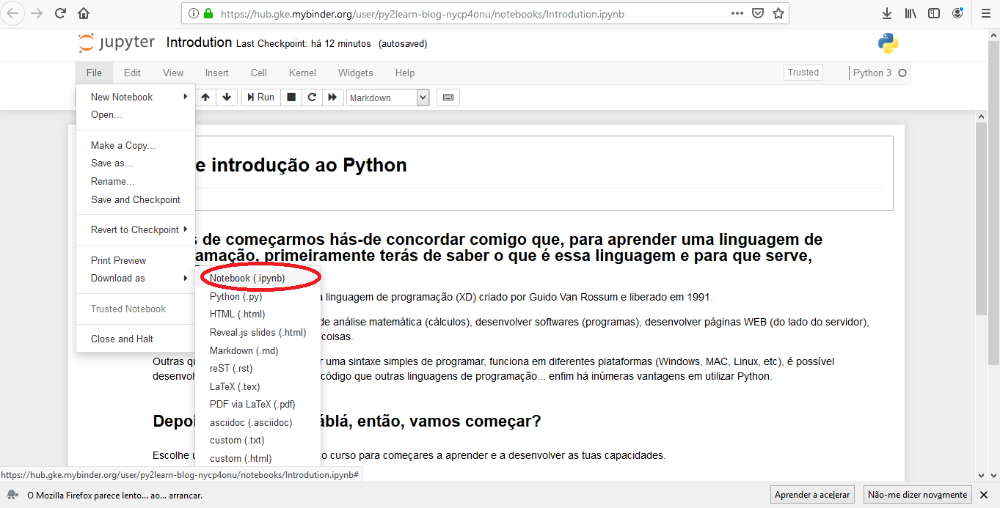

# Antes de iniciares o teu curso vamos ensinar-te como navegar utilizar um notebook.

## Para fazer correr um célula, o que fazes é selecionar a célula e carregar no botão **Run**.

## Para criar nova célula clica no botão "+".

## Visto que cada célula está associada a um tipo (Markdown - texto; Code - código; Raw NBConvert - código que não vai ser corrido), para criar uma célula deve-se especificar o seu tipo alterando na lista dropdown.

## Para guardar as alterações é só carregar no icon do guardar.

## Caso queiras baixar para o teu computador o teu notebook alterado, na aba "File" podes escolher a opção "Download as" e de seguida "Notebook"

## Clica num dos icons abaixo e inicia o teu curso, tornando-te assim num expert!!!

Português   
Inglês - 
